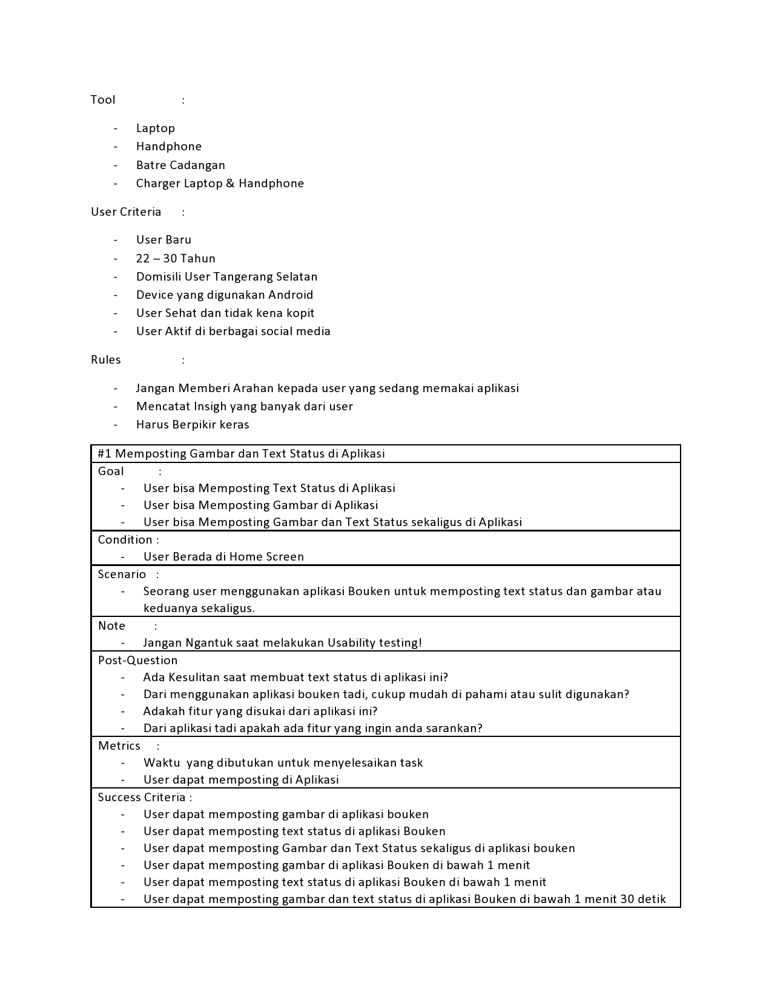

# 10 Offlane Usability

## Resume
Dalam materi ini, mempelajari:
1. Pengertian Usability Testing
2. Kapan Harus melakukan Usability Testing
3. Kenapa Harus Usability Testing
4. Mempersiapkan Usability Testing

## Pengertian Usability Testing
Sebuah sesi dimana researcher ( Fasilitator )memberikan sebuah skenario kepada user untuk menyelesaikan satu atau lebih dari tugas terhadap suatu desain tampilan interface atau prototype

## Kapan Harus Melakukan Usability Testing
Untuk melakukan usability testing ada 3 fase yang harus di perhatikan untuk memulainya :

### - Fase Awal
di fase awal ini di saat kita sudah melakukan riset dari masalah user
dan membuat solusi interface dan belum melakukan Development atau pengembangan 

### - Fase Tengah
Di fase tengah ini dimana ketika kita sudah mendevelop suatu produk
oleh enginer dan terbentuk produk itu sendiri bisa melakukan kembali 
usability enginer

### - Fase Akhir
di fase terakhir ini, sebelum di rilis ke market dari beberapa banyak
proses yang telah di lakukan bahwa 

## Kenapa Harus Usability Testing
### - Menemukan Masalah
menemukan masalah adalah dimana seorang user yang telah menggunakan
aplikasi dan pengalaman user terhadap aplikasi yang di pakai ini 
menemukan sedikit ketidak nyamanan aplikasi terhadap user

### - Menemukan Kesempatan
Menemukan kebiasaan user di saat menggunakan aplikasi yang dipakai
dan dari situ kita bisa meriset dari penggunaan aplikasi untuk bisa
kita tau kesempatan yang di dapat dari user saat memakai aplikasi

### - Mempelajari Kebiasaan UserMempelajari kebiasaan user ini melakukan riset terhadap aplikasi
yang di pakai untuk kita bisa tau kebiasaan yang sering di lakukan
dari user ini agar kita tau insighnya

## Mempersiapkan Usability Testing
- Menentukan Target User
- Memilih Metric
- Membuat Skenario
- Menyiapkan Prototype
- Menentukan Team
- Menyiapkan Team

## Task
## 1. Membuat Prototype 
Pada task ini, Hanya membuat prototype yang sudah ada dan bebas menggunakan animation/transisi yang tersedia di Figma 

Berikut hasil dari praktikum ini.

[linkfigma.txt](./praktikum/linkfigma.txt)

output:

