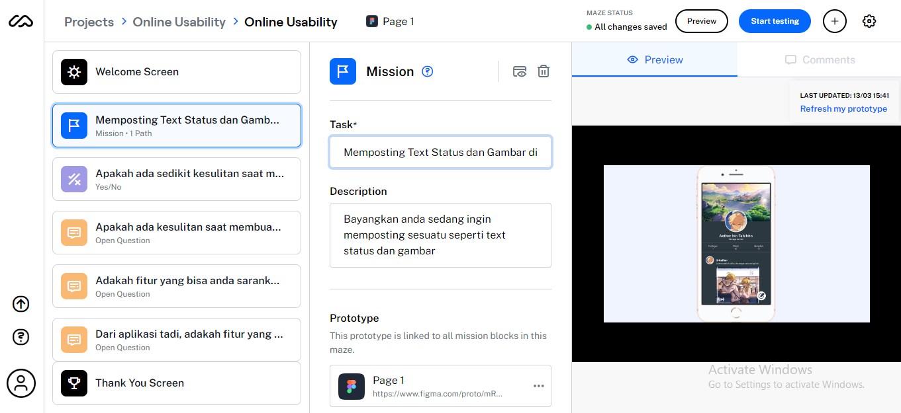

# 11 Online Usability

## Resume
Dalam materi ini, mempelajari:
1. Kelebihan Usability Testing
2. Persiapan Online Usability Testing
3. Tips Online Usability Testing

## Kelebihan Usability Testing
- Dapat menemukan user dengan mudah dimana saja
- Lebih Cepat dan lebih Murah biaya
- Jangkauan user yang sangat luas
- Lebih Efisien

## Persiapan Online Usability Testing
Adapun beberapa hal yang harus di persiapkan sebelum melakukan Online Usability testing seperti :
- Persiapan
- Usability Testing
- Mengelola Insight Usability Testing

dan biasanya Tool yang di gunakan dalam membuat Online Usability Testing seperti :
- Figma ( Figma sebagai Desain Interface )
- Maze ( Sebagai Testing Projek untuk user secara online )

Adapun persiapanya seperti :
- Membuat clickable prototype pada desain interface di figma kita
- Setup Block Skenario di Maze
- Jalankan dan Share link online usability Testing kepada user 

## Tips Online Usability Testing
- Mulai dari tujuan yang simple
- Berikan 1 tugas dalam sekali waktu
- Tugas yang di berikan pastikan realistis dan menyerupai kehidupan sebenarnya
- Menambahkan Pertanyaan di tengah - tengah skenario
- Buat Alternative 
- Berikan konteks yang tepat
- Rule of 5 Second Impression

## Task
## 1. Menjalankan Online Usability Testing di Maze
Pada task ini, Menjalankan dari hasil Tugas Skenario sebelumnya menggunakan Maze.

Berikut hasil dari praktikum ini.

[linkmaze.txt](./praktikum/linkmaze.txt)

output:

