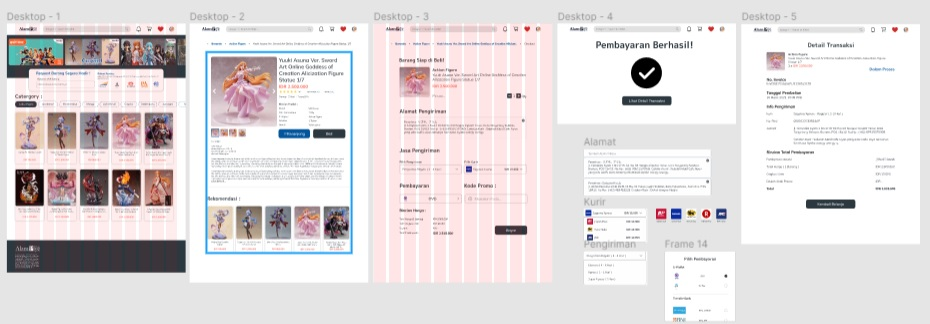

# 12 Conceptual Design

## Resume
Dalam materi ini, mempelajari:
1. Keep is short and simple
2. Make it easy Undestand
3. Make Progress to user Visible 
4. Make Progress Meaningful in Order to Reward User

## Keep is short and simple
KISS ini adalah sebuah penggunaan Desain yang di buat se simple. agar tidak rame dalam berbagai informasi yang tidak seharusnya ada, dan dapat di filter dengan baik. Bagaimana cara melakukan KISS itu sendiri, berikut tips nya:
- untuk melihat kata atau kalimat 
- Jangan manfaatin 1 hal doang. contoh sertakan text button
- lakukan testing ke semua orang

## Make it easy Undestand
- Ciptakan konsisten visual strategi
- Gunakan shape dari pada lines aja
- Gunakan animasi untuk menginteraksi berbagai halaman
- Gunakan Informasi yang bagus
- Silahkan kreasi sesuai kebutuhan kalian

## Make Progress to user Visible
- membangung komunikasi dari aplikasi yang kita buat
- Ngebantu user experience aplikasi yang kita buat

## Make Progress Meaningful in Order to Reward User
Dengan melakukan ini untuk dapat menarik para pengguna user yang berada di aplikasi kita. dengan contoh ada beberapa cara untuk Meaningful Reward untuk user, Seperti :
- Informational
- Social
- Gamification
- Monetization

## Task
## 1. Membuat Sebuah Product Seperti Toko Online / E Commerce
Pada task ini, ada beberapa Poin dalam membuat Toko online / E Commerce
1. Buatlah Sebuah detail product sebuah toko online
2. Buatlah tampilan notifikasi ketika telah berhasil untuk membeli
3. Pastikan detail product kalian memiliki detail root seperti gambar di bawah
4. Buatlah Sebuah prototyping dari halaman yang telah kalian buat. Sehingga, menampilkan animasi yang menarik untuk user

Berikut hasil dari praktikum ini.

[linkfigma.txt](./praktikum/linkfigma.txt)

output:

