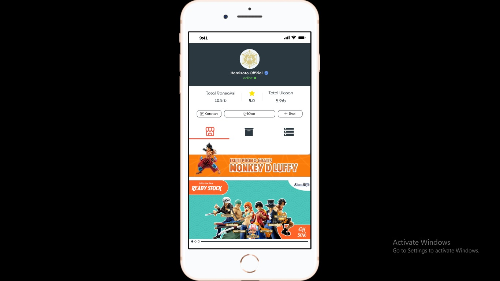

# 13 Behavior Change Strategies

## Resume
Dalam materi ini, mempelajari:
1. Fogg Behavior Model
2. Fogg Behavior Grid
3. BA Good Prompt

## Fogg Behavior Model
konsep yang dirancang untuk menjelaskan tingkat adopsi produk oleh mengkonsumsi publik tetapi juga dapat diterapkan ke berbagai aplikasi. Dan dalam hal ini ada beberapa hal seperti Motivation, Ability, Prompt yang adapat mengubah behavior user.

## Fogg Behavior Grid
Masing-masing dari 15 jenis Perilaku menggunakan strategi psikologi yang berbeda dan teknik persuasif.
- Green
- Blue
- Purple 
- Gray
- Black

Dan adapun Behavior seperti :
- Dot : behavior yang bisa di bilang di pakai sekali, tapi dapat di pakai juga berkali - kali dalam hal tertentu
- Span : behavior yang hanya di pakai di waktu tertentu
- Path : behavior yang di lakukan terus mengulang dan melanjutkan

## A Good a Prompt
- Bermakna dalam konteks pengguna, itu terhubung dengan tujuan pengguna
- Datang pada waktu yang tepat (pengguna termotivasi + mampu melakukan tindakan)
- Menarik perhatian pengguna

## Task
## 1. Membuat sebuah desain UI UX di sebuah Toko Online. 
Pada task ini, Membuat Sebuah desain UI UX di sebuah perusahaan toko online yang di lanjutkan dengan beberapa poin di bawah :
1. Buatlah sebuah desain untuk halaman promo, yang nantinya akan di share
2. Buatlah halaman welcome page untuk toko tersebut, sehingga dapat memotivatsi user untuk membeli
3. Ketika ingin keluar buatlah sebuah alert yang menerapkan promp secara maksimal

Berikut hasil dari praktikum ini.

[linkfigma.txt](./praktikum/linkfigma.txt)

output:

