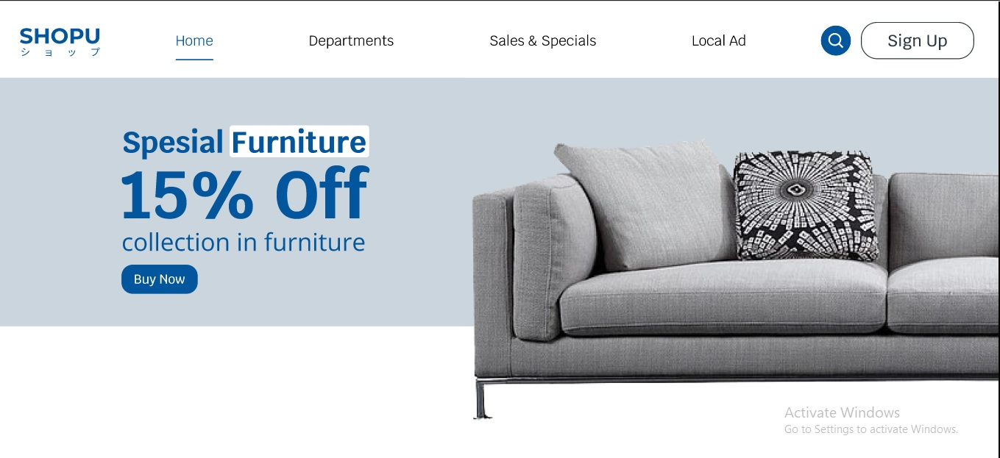

# 15 Layouting Rules

## Resume
Dalam materi ini, mempelajari:
1. Negative Space
2. Proximity
3. Contrast
4. Alignment
5. Focal Points

## Negative Space
Cukup mengacu pada area pada desain Anda yang tidak diambil oleh aset desain dan grafik yang sebenarnya

## Proximity
Proximity basilly menyarankan bahwa elemen desain yang terkait dalam beberapa cara, atau memiliki hubungan, harus dikelompokkan bersama.
Kedekatan dan ruang negatif memang memiliki hubungan, dan keduanya harus diperhitungkan saat merancang sesuatu dalam hal tata letak

## Contrast
Secara sederhana mengacu pada 2 elemen desain dari aspek yang berbeda dalam tampilan dan sifatnya.Untuk menciptakan kontras Anda dapat bereksperimen dengan warna, jenis huruf, bentuk dan ukuran

## Alignment
Dalam desain grafis, kita harus selalu memperhatikan keselarasan, apakah itu untuk teks, untuk citra, atau elemen desain secara umum, Anda harus selalu melihat untuk menyelaraskan pekerjaan Anda secara profesional, dan tidak membuat kesalahan pemula dengan mengabaikan keselarasan.

## Focal Points
Titik fokus digunakan pada desain untuk menunjukkan dengan tepat awal perjalanan tampilan, dan merupakan hotspot untuk menarik perhatian dan memikat mereka ke dalam desain itu sendiri

## Task
## 1. Meredesain Sebuah Welcome Page
Pada task ini, ada beberapa point meredesain sebuah welcome page :
 1 Lakukan redesign halaman pembelian furniture di samping menggunakan figma, halaman tersebut ditunjukan untuk bagian navbar dan welcome page.
 2 Kalian bebas menambahkan fitur asalkan jangan sampai menambah halaman baru.
 3 Beberapa hal yang akan perlu kalian perhatikan
	a. Cara kalian memanfaatkan negative space
	b. Mengatur proximity yang ada
	c. Cara kalian mengatur alignment pada welcome page
	d. Menentukan focal point

Berikut hasil dari praktikum ini.

[linkfigma.txt](./praktikum/linkfigma.txt)

output:

