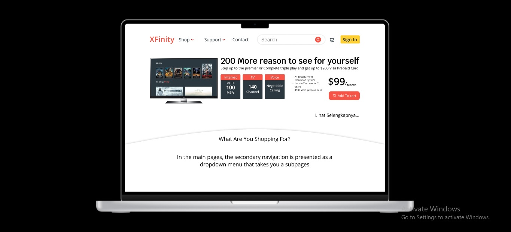

# 16 UX Researcher

## Resume
Dalam materi ini, mempelajari:
- When Research
- What is UX
- User Journey

## Why Research
New product Development Process
#### - Pembuatan Ide-> Penyaringan-> Evaluasi Ide-> Pengembangan-> Evaluasi Produk

- Penyelidikan
Untuk Menemukan Peluang untuk inisiatif baru

- Generatif
Untuk lebih memahami antara beberapa konsep

- evaluatif
Untuk Temukan area untuk perbaikan

## What is UX
Pengalaman pengguna adalah bagaimana pengguna berinteraksi dengan dan mengalami produk, sistem, atau layanan

## User Journey
- Jangan buat peta perjalanan pelanggan tanpa persona
- Jangan Membuat peta terlalu tinggi
- Jangan membuat peta terlalu rendah
- Fokus pada proses
- Bumbui peta perjalanan Anda dengan visual
- Tambahkan item yang dapat ditindaklanjuti
- Tambahkan yang bertanggung jawab untuk setiap tahap

## Step by Step: Dos and don'ts during the testing
- Beri tahu peserta bahwa Anda sedang menguji desain Anda, bukan mereka. Ini bukan ujian
- Amati dan catat hal-hal yang dilakukan peserta pada desain Anda. Perekam layar akan membantu Anda mengingat perjalanan nanti
- Biarkan peserta bereksplorasi terlebih dahulu, jawab pertanyaan setelah sesi selesai
- Dorong peserta untuk berbicara dengan lantang
- Ajukan pertanyaan lanjutan setelah peserta menyelesaikan tugas
- Jangan mengajukan pertanyaan yang mengarah atau mengungkapkan pernyataan yang tidak netral

## Choose UX research method
- Putaran umpan balik wawancara, kartu, sortir, atau tes kegunaan yang lebih pendek
- Bery di awal pengembangan produk -> studi lapangan
- Mockup atau prototipe -> pengujian kegunaan
- Data skunder, seperti penelitian yang telah dilakukan di organisasi Anda atau penelitian meja
- percakapan dengan pengguna Anda -> wawancara pengguna
- Studi sekelompok orang -> Grup fokus
- mengintip bagaimana pengguna berinteraksi dengan produk kami dalam skenario dunia nyata -> studi diadry

## Task
## 1. Membuat Tugas Kelompok dan me redesign halaman
Pada task ini, ada beberapa point membuat Redesign :
1. Buatlah kelompok sebanyak 4 orang.
2. Tugas Kalian adalah untuk melakukan redesign halaman di samping
3. Setidaknya untuk melakukan redesign kalian haus melakukan interview antar anggota kelompok
4. Catatlah hasil interview ke dalam google doc
5. Setiap redesign yang kalian harus bersarkan hasil data interview

Berikut hasil dari praktikum ini.

[linkfigma.txt](./praktikum/linkfigma.txt)

output:

