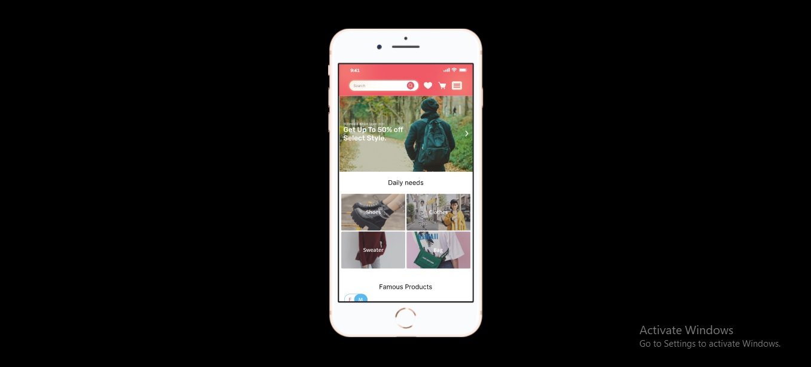

# 17 Guides Mobile

## Resume
Dalam materi ini, mempelajari:
1. Theme
2. App Architecture
3. Visual Design
4. Icons and Image

## Theme
You'll need to meet high expectations for quality and functionality

## App Architecture
### - Launching
Provide a launch screen
Launch in the appropriate arientation
Avoid asking for setup information uo front
Aboid showing in app licensing agreements and disclaimers
Restore the previous state when your app restarts
Don't ecourage rebooting
avoid asking people to rate your app too quickly or to aften

## Visual Design
### -Auto Layout size classes
A view may prossess any combination of size classes:
- Regular width, reguler height
- Compact width, Compact height
- Regular width, compact height
- Compact width, regular height

## Image
### - Image Size and rosolution

- Embrace simplicity
- Provide a single focus point
- Design a recognizable icon
- Keep the background simple and avoid transparency
- Use words only when they're essential or part of a logo
- Don't include photos, screenshots, or interface elements
- Don't use replicas of APple hardware product

## Task
## 1. Membuat sebuah desain Mobile App
Pada task ini, ada beberapa point membuat desain Mobile app :
1. Rubahlah desain website di samping menjadi mobile.
2. Pastikan kalian memperhatikan perubahan navbar
3. Buatlah prototyping pada design websitenya. Sehingga terlihat user experience pada saat iser menggunakan aplikasi pada bentuk website

Berikut hasil dari praktikum ini.

[linkfigma.txt](./praktikum/linkfigma.txt)

output:

