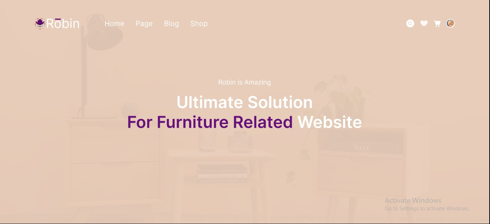

# 18 Web Guides

## Resume
Dalam materi ini, mempelajari:
1. Design for scanning, not reading
2. Get to the point
3. Don't Change the map
4. Increase your Reservoir of Goodwill

## 1. Design for scanning, not reading
- Konvensi yang diterima secara universal oleh pengguna
- Buat hierarki visual
- Jelaskan apa yang dapat diklik
- Tidak memberi Anda semua detail sekaligus

## 2. Get to the point
- Sekali lagi dengan menghemat waktu - orang tidak mencari basa-basi di internet
- Buat klik tanpa berpikir
- Anda perlu menghapus kata atau kalimat filter

## 3. Don't Change the map
- Orang-orang mengingat pengalaman berinteraksi dengan situs web dan aplikasi
- Navigasi Persisten
- Nama Halaman
- Anda di sini navigasi

## 4. Increase your Reservoir of Goodwill
- Buat hal terpenting yang ingin dilakukan pengguna Anda di situs Anda semudah mungkin
- Bersikaplah terbuka tentang informasi yang ingin dilihat pengguna
- Simpan langkah di mana pun Anda bisa
- Adalah baik untuk meminta maaf kepada pengguna ketika Anda tidak dapat melakukan apa yang diharapkan pengguna yaitu halaman 404 atau beberapa fungsi pembatas yang
  Anda tahu pengguna akan menginginkannya tetapi karena alasan tertentu Anda tidak dapat menyediakannya

## Task
## 1. Membuat sebuah desain Web
Pada task ini, ada beberapa point membuat desain Web :
1. Rubahlah desain mobile di samping menjadi website
2. Pastikan kalian memperhatikan perubahan navbar
3. Buatlah prototyping pada design websitenya, sehingga terlihat user experience pada saat user menggunakan aplikasi pada bentuk website

Berikut hasil dari praktikum ini.

[linkfigma.txt](./praktikum/linkfigma.txt)

output:

