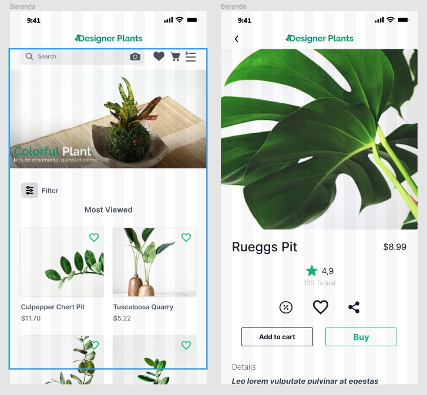

# 20 Visual Hierarchy

## Resume
Dalam materi ini, mempelajari:
1. Apa itu Visual Hierarchy
2. Layout of Screen Elements
3. The Basics of Visual Design

## Apa itu Visual Hierarchy
Visual Hierarchy adalah prinsip yang mengatur elemen desain untuk menunjukkan urutan kepentingannya. Designer menyusun karakteristik visual misalnya, icon pada 
sebuah menu sehingga user dapat memahami informasi dengan mudah. Dengan meletakkan elemen secara logis dan strategis, desainer dapat mempengaruhi persepsi user 
dan membimbing mereka ke action (tindakan) yang diinginkan.

## Layout of Screen Elements
### - Size and spacing system
Ukuran headlines dan subheading memberikan petunjuk kepada user tentang keteraturan dan kepentingnya. Headline akan cenderung lebih besar dan lebih dramatis karena 
ukuran yang kontras, berat secara visual, atau highlight dari warna nya.

### - Position
Cukup dengan melihat ukuran, posisi, dan warna layout pada gambar disamping, kalian bisa menebak elemen yang paling penting dari masing-masing empat contoh.

### - Density
Density (Kepadatan) mengacu pada kepadatan ruang antara elemen pada sebuah desain. Melihat contoh pada gambar di sebelah kanan, gambar yang kiri menunjukkan
layout yang lebih padat dimana kontennya berkumpul bersama. Contoh di sebelah kanan memiliki tampilan yang lebih terbuka dengan konten menyebar secara merata.

### - Background color
Menambahkan shadow atau background color akan menarik perhatian ke blok teks dan membedakan blok tersebut dari teks lain. Contoh di sebelah gambar sebelah kiri
memiliki background color yang konsisten untuk semua elemen. Ini menandakan tidak ada perbedaan dan kesinambungan dari pentingnya elemen. Sebagai perbandingan, 
pada gambar sebelah kanan, layout yang di tengah diberikan background color dan elemen kontras sehingga mata kita langsung menarik perhatian untuk itu.

### - Rhythm
List, grid, whitespace, dan elemen alternatif seperti headline dan summaries dapat menciptakan ritme visual yang kuat yang menarik perhatian mata.

### - Emphasizing small items
Untuk menonjolkan elemen desain yang kecil, bisa disimpan di atas, di sepanjang sisi kiri, atau di pojok kanan atas. Berikan elemen tersebut kontras tinggi dan 
bobot visual, dan atur dengan whitespace. Namun perhatikan bahwa di layar yang penuh teks, seperti web pada umumnya, terutama elemen search box, sign-in fields, 
dan button; biasanya elemen tersebut cenderung menonjol. Contoh : jika user mencari search box, mata mereka akan langsung tertuju pada text field di halaman tersebut.

### - Alignment and grid
Dalam desain digital kemudahan membaca itu sangat penting. Kemudahan tersebut dapat membantu memandu user ke informasi dan action (tindakan). Maka membuat desain 
yang didasarkan pada grid memungkinkan designer untuk fokus pada konten, dan yakin bahwa layout-nya akan memiliki konsistensi dan keseimbangan secara visual.
Grid juga membantu banyak desainer bekerja secara terpisah tetapi masih akan dengan mudah menata layout secara bersamaan.

## The Basics of Visual Design
### - Color and contrast
Desain visual yang baik menggunakan warna atau kontras (atau keduanya) untuk membuat hirarki visual pada sebuah halaman desain. Menerapkan warna pada desain membuat 
beberapa elemen tampak menonjol dan yang lain sebaliknya, dan dengan demikian, warna dapat menentukan elemen apa yang dapat menarik perhatian kita dan menentukan 
kepentingan pada berbagai elemen desain.

### - Typography
Mayoritas konten di web, selain image dan  video adalah teks. Tipografi adalah seni mengatur pesan dalam komposisi yang dapat dibaca dan estetis. Tipografi adalah 
elemen integral dari sebuah desain

### - Evoking a feeling
Desain tipografi juga memiliki kekuatan yang besar untuk mempengaruhi sebuah pesan. Saat digunakan dengan cara yang benar dengan memanfaatkan kombinasi gaya, 
ukuran, hierarki, kerning, dan spasi baris yang tepat; tidak ada yang tidak bisa kamu ekspresikan dengannya. Dari mulai desain halaman formal dan elegan hingga 
komposisi dinamis dan mencengangkan, kamu dapat melakukan apa pun yang dapat kamu imajinasikan.

### - Images
Sebuah fotografi dapat mengatur mood sebuah desain. Di web dan mobile, fotografi adalah salah satu alat paling ampuh untuk menetapkan bagaimana brand diekspresikan.
Foto (images) yang ditempatkan dengan baik dapat menceritakan sebuah kisah hanya dalam sekali pandang, dan umumnya akan jauh lebih efisien daripada memanfaatkan 
kata-kata atau kalimat.

## Task
## 1. Melakukan Improve pada Desain untuk menjadikan visual hierarchy
Silahkan kalian improve dari link figma diatas untuk menjadikan screen tersebut mempunyai Visual Hierarchy

Akan lebih bagus apabila…
1. Memanfaatkan style management di figma untuk hasil yg lebih efektif dan efisien
2. Styling ulang menggunakan/memanfaatkan design style masing-masing mentee

Berikut hasil dari praktikum ini.

[linkfigma.txt](./praktikum/linkfigma.txt)

output:

