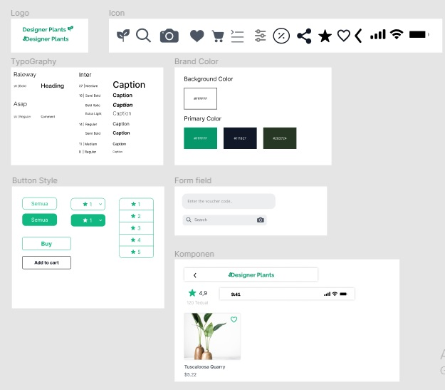

# 21 Design System

## Resume
Dalam materi ini, mempelajari:
1. Design System itu apa
2. Perbedaan Style Guide / Ui Kit, Component Library dan Design System
3. Tujuan Design System
4. Bagaimana cara membangun sebuah design system

## Design System itu apa
Design System adalah sebuah standarisasi yang mengatur setiap elemen desain untuk mengurangi redudansi. atau bisa di artikan juga Design System adalah kumpulan 
prinsip dan praktik bersama yang membantu menginformasikan pekerjaan designer, product manager, dan developer, serta sales dan marketing.

## Perbedaan Style Guide / Ui Kit, Component Library dan Design System

### - Style Guide / UI Kit
Dokumentasi yang masih bersifat statis. Jadi, masih menyingkup color, typography, iconography dan masih banyak lagi.

### - Component Library
Dokumentasi kumpulan style dan component yang bisa digunakan dan dibagikan ke tim. Ini bisa jadi memasukkan dokumentasi koding dari setiap component. Contoh component 
nya seperti button, text field, checkbox dan yang lainnya.

### - Design System
Dokumentasi kumpulan element, component, dan regions yang sudah ditentukan, termasuk guideline-nya  Designer dan Front-end Developer. Contohnya, kapan button ini 
digunakan, kenapa pakai warna ini (ada alasan di setiap component).

## Tujuan Design System
- Brand Konsisten 
- Menjadi company identity
- Mempunyai nilai yang sama antar pegawai

## Bagaimana cara membangun sebuah design system
- Evaluasi inventaris UI kamu saat ini dan catat inkonsistensi pada desain yang kamu buat
- Bangun sebuah pattern library dari berbagai elemen desain yang sama
- Dokumentasikan aturan desain kamu, lalu atur juga bagaimana dan kapan elemen-elemen desain itu dapat digunakan

## Task
## 1. Melakukan Mini Design System
Pada task ini, Breakdown UI dari tugas sebelumnya dengan melakukan Mini Design System

Berikut hasil dari praktikum ini.

[linkfigma.txt](./praktikum/linkfigma.txt)

output:

