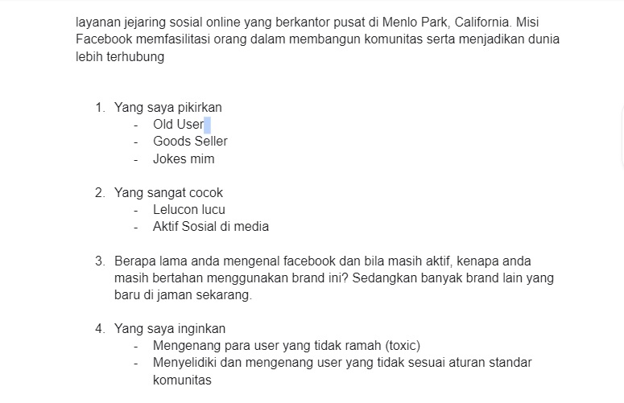

# 14 Basic Principle

## Resume
Dalam materi ini, mempelajari:
1. Microcopy, Apa itu?
2. Dampak Microcopy di UI
3. Voice and Tone Design

## Microcopy, Apa itu?
Menurut Kinneret Yiffrah, microcopy adalah kata atau frasa di UI yang terkait langsung dengan tindakan yang dilakukan user :
- Motivasi sebelum tindakan
- Instruksi yang menyertai tindakan
- Feedback setelah user mengambil tindakan

## Dampak Microcopy di UI
- Menciptakan experience yang positif dan melibatkan user
- Meningkatkan dari sisi usability
- Meningkatkan branding dan diferensiasi

## Voice and Tone Design
Voice and Tone Design menentukan bahasa yang akan digunakan pada brand saat berkomunikasi dengan user di UI kalian. Voice and Tone akan menjaga bahasa yang digunakan 
pada brand sejalan dengan nilai utama dan dukungan mereka, agar tidak menciptakan ketidakselarasan dan ketidak konsisten.

- Voice lebih ke pilihan kata yang konsisten, dan dapat dikenali di seluruh pengalaman nya.
- Tone mengarah ke variasi dalam suara (voice) dari satu bagian pengalaman ke bagian yang lain.

### - Cara menentukan Voice Design

- Baca design brand yang sudah kalian tulis, dan coba filter informasi penting tentang brand kalian
- Dengarkan apa yang user katakan dan coba filter entah dari quotes, kata yang otentik, dan kata yang sering diulang oleh user
- Adakan interview tentang personality brand dan target audiens nya kalian ke orang terdekat
- Hasilkan Voice Design dari poin diatas

## Task
## 1. Membuat sebuah Voice Design
Pada task ini, ada beberapa point membuat sebuah Voice Design :
1. Jika brand tersebut adalah orang, dan mereka lagi jalan, apa tiga hal yang pertama kali kalian pikirkan ke mereka?
2. Personality mana yang sangat cocok dengan brand kalian?
3. Ketika menanyakan brand kalian, user ingin mengatakan apa tentang brand kalian?
4. Problem apa yang ingin kalian solved dari brand kalian?
Setelah selesai menjawab pertanyaan diatas, silahkan kalian pilih personality apa yang sesuai dengan brand kalian, dan sertakan alasannya

Berikut hasil dari praktikum ini.

[linkgoogledoc.txt](./praktikum/linkgoogledoc.txt)

output:

