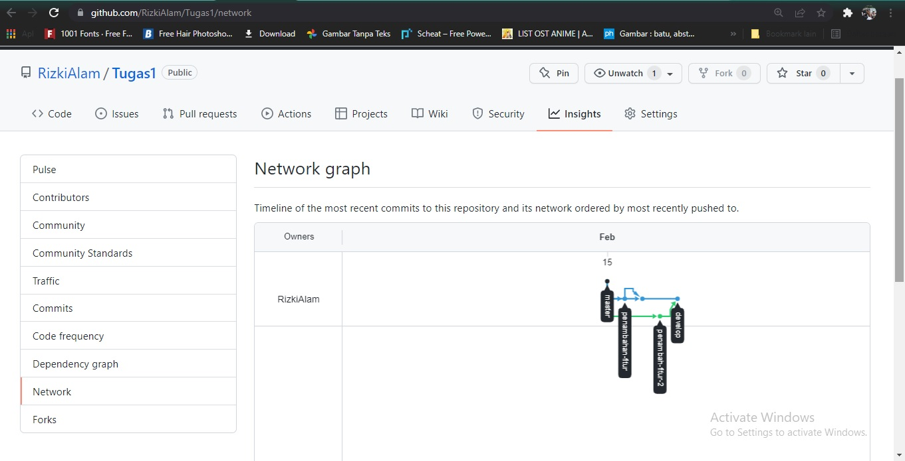

# 2 Version Control and Branch Management (Git)

## Resume
Dalam materi ini, mempelajari:
1. Memperkenalkan Git dan GitHub serta cara instalasi dari Git
2. Memahami konsep 3 Area pada repo Git
3. Mempelajari Branch, Pull request dan merge

### 1) * Git 
Git ini adalah sebuah Version Control Sistem yang mengelola histori dan perubahan dari sebuah dokumen, source code, program komputer dan kumpulan informasi lainya 
dan dapat di kembangkan secara bersama - sama. dan git ini bisa di bilang sebuah Versi control sistem software untuk megolah perubahan file di dalam folder (repositori).
dan saat serangkaian file perubahan disimpan menggunakan commit.

###    * Github
Github ini adalah layanan cloud untuk menyimpan dan mengelola projek. serta bisa di katakan instagramnya para programer dengan mengupload projek repositori/source code
agar orang lain dapat bisa lihat. dan pada dasarnya git ini dapat melakukan repo, commit seperti di local/komputer kita secara online atau cloud internet.

### 2) saat sudah membuat repo git memiliki 3 area sebagai berikut
- Area pertama ( Working Directory ) : adalah Area tempat projek untuk bekerja yang mempunya folder dan di isi dengan file - file projeknya
- Area kedua ( Staging Area ) : adalah area yang sudah diberitahukan kepada git kalau sudah ada perubahan
- Area ketiga ( Repositoy ) : adalah area yang sudah di commit dari Staging area 

Area kedua ( Staging Area ) dan Area ketiga ( Repositoy ) akan tersimpan dalam sebuah folder .git. pada saat projek di inisialisasi sebagai repo maka otomatis git akan 
membuat folder .git.

### 3) * Branch 
Sebuah repositori dan dimana di dalam repositori itu sudah melakukan banyak commit.

###    * Pull Request
Branch yang meminta kepada master atau main dapat menarik perubahan.

###    * Merge
Penggabungan antara  branch satu ke branch lainya untuk bisa menambahkan perubahan pada branch master atau main.

## Tugas
### 1. Membuat Repositori
Pada tugas ini, membuat 4 branch dengan branch master 1, branch develop 1, dan 2 branch penambah fitur.

output:

