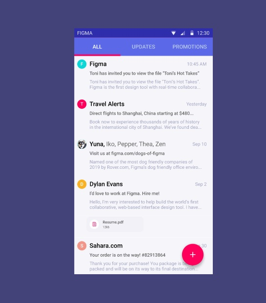

# 3 Fundamental of UI/UX

## Resume
Dalam materi ini, mempelajari:
1. Apa itu UI/UX
2. Design Thinking
3. Basic Rule
4. Jenis Prototype
5. Jenis User Testing

### UI/UX
-  UI ini sebuah tampilan antar muka meliputi visual atau suara di aplikasi digital untuk menginformasikan kepada user.
- sedangkan UX ini kesan atau pengalaman yang di tinggalkan oleh user di sebuah aplikasi 

 
### Design Thinking
Sebuah metode yang digunakan untuk memecahkan masalah dengan solusi yang bagus dan efektif. Tahapan pada 
Design Thinking ada 5, yaitu:
- Empathize : Memahami prespektif dan perasaan yang di alami oleh CS ( customer) seperti keluhanm, kinginan, dll.
- Define    : Mendefinisikan permasalahan CS ( Customer ) yang akan di selesaikan dari sudut pandang CS ( Customer ).
- Ideate    : Memecahkan ide dan solusi sekreatif mungkin dan memilih solusi atau ide yang terbaik.
- Prototype : Proses membuat sebuah prototipe atau mewakili fungsi yang dapat di gunakan user.
- Test      : Proses menguji coba oleh CS ( Customer ) untuk mendapat solusi dari data solusi yang di buat.

### Basic Rule
Basic Rule ini memiliki aturan sendiri untuk menyelesaikan masalah UI/UX, contohnya :
- Memahami user
- Kejelasan Sistem
- Real Life ( Menyerupai seperti aslinya )
- Kebebasan Pengguna
- Konsisten 
- Mencegah Error
- Mengenali daripada mengingat 
- Fleksibel 
- Estetik

### Jenis Protype
- Low Fidelity : Sketh awal denga tujuan menentukan atau menemukan garis besar aplikasi yang akan di buat.
- Medium Fidelity : Sketch kedua yang dimana pembuat sudah meletakan berbagai macam informasi dan fungsi seperti 
Text atau button dengan gambaran yang sudah tidak kasar lagi.
- High Fidelity : Sketch akhir yang sudah diberi semacam Warna dan beberapa icon dan text serta touch up.

### Jenis User Testing
- Offline User Testing : Memastikan kepada user solusi yang telah di buat ini sudah tepat apa belum.
- Geurilla User Testing : Melakukan testing di tempat umum yang sudah di set untuk dapat di coba oleh para user di sana.
- Online User Testing   : melakukan user testing pada rancagan sebuah aplikasi atau dekstop secara daring.

## Task
### 1. Mencari User Interface
Pada task di section ke 3 ini. Mencari contoh user interface Dekstop/Aplikasi dan Mengidentifikasi usernya.

Berikut kode hasil dari praktikum ini.

[linkgoogledoc.txt](./praktikum/linkgoogledoc.txt)

output:

