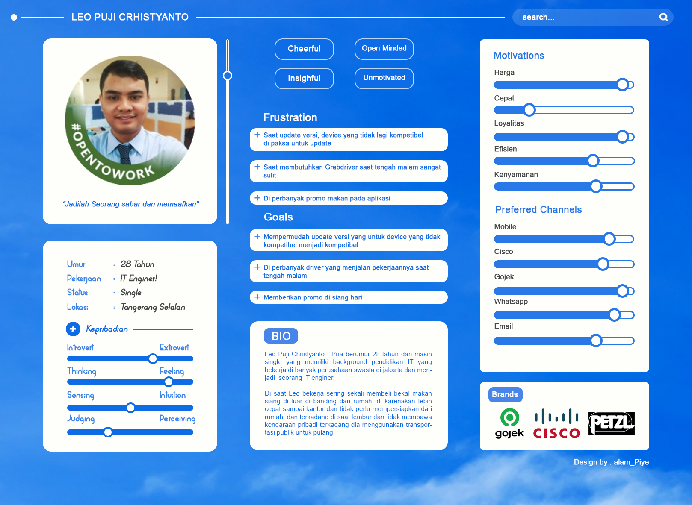
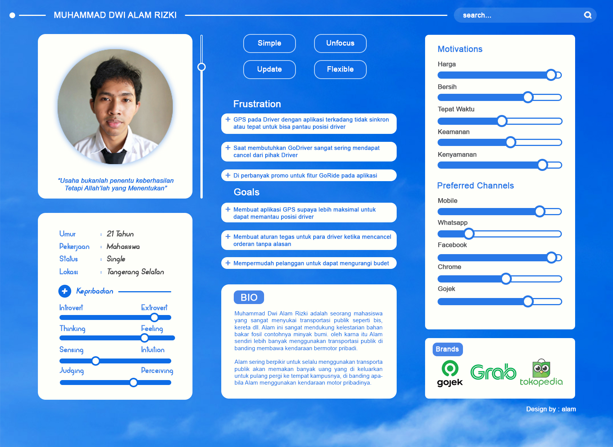

# 4 User Persona

## Resume
Dalam materi ini, mempelajari:
1. Pentingnya User Persona
2. Jenis & Research User Persona
3. Membuat User Persona
4. Emphaty Interview

## Pentingnya User Persona
Dengan memberi illustrasi atau gambaran jelas kepada user. Seorang Desainer produk bisa dapat mudahnya memahami pada user mereka. sperti contoh, Kebutuhan yang di inginkan user,
Memberi sebuah solusi untuk user, dan Apa Expetasi dari user.

Membantu user mengambil keputusan dari illustrasi atau gambaran melalui user persona. Agar dapat menentukan hasil keputusan yang tepat untuk kedua belah pihak.
Selain UI/UX Design yang butuh Menggambarkan hasil research user persona, Perusahaan lain seperti marketing dan bisnis juga sangat butuh ini karna sebagai acuan untuk mengetahui
siapa saja target market.

## Jenis & Research User Persona
- ### Jenis - Jenis User Persona
    ####  - Persona Marketing 
      User Persona yang digunakan untuk mengetahui apa kebutuhan dan motivasi user terhadap penggunaan produk
    ####  - Persona Interaktif
      User persona yang berhubungan langsung dengan behaviour/perilaku penggunaan produk.
      

- ### Jenis - Jenis User Persona
    ####  - Research Kualitatif
      Merupakan penelitian yang didasarkan pada kualitas produk berupa ide atau konsep. Penelitian model ini di lakukan pada 
      sejumlah user dengan skala kecil dengan metode wawancara dan testimoni penggunaan produk.

    ####  - Persona Interaktif
      Merupakan penelitian yang didasarkan pada kuantitas untuk membuktikan hipotesis yang sudah ada. Penelitian model ini 
      dilakukan pada sejumlah user dengan skala besar dengan metode surveo dan log file analysis/site traffic.
      
## Membuat User Persona 
- #### Header
  Header terdiri dari nama Fiktif, photo dan kutipan dari user tersebut
- #### Profil Demographic
  Background personal meliputu umur, gender, etnic, pendidikan dan group persona
- #### personal Background
  kurang lebih sama seperti Profil Demographic akan tetapi untuk Profil Demographic ada penambahan lokasi
- #### Professional Background
  Informasi yang berkaitan dengan pekerjaan dari user persona tersebut
- #### Lingkungan User
  Informasi tentang lingkungan dari user, mulai dari lingkungan tempat dia tinggal sampai lingkungan dia bekerja
- #### Psikografis
  Inforamasi tentang hal apa yang memotivasi user, keinginan dan hal apa yang di hindari user
- #### Tujuan
  Informasi tentang tujuan user dalam kontek masalah apa yang mau di selesaikan dengan menggunakan aplikasi kita
- #### Skenario user
  Informasi tentang sebuah paragraf yang menjelaskan tentang skenario user bagaimana dia akan menggunakan aplikasi yang kita buat
  
## Emphathy Interview
Sebuah kegiatan wawancara biasa pada umumnya akan tetapi kita ber empati kepada user sebagai teknik untuk memudahkan kita memperoleh kebutuhan user.
beberapa daftar pertanyaan yang berguna juga perlu untuk kita persiapkan dulu untuk mengumpulkan informasi terkait keinginan dan kebutuhan user

Ada beberapa tips untuk melakukan Wawancara :
- Tanyakan Mengapa
- Jangan Tanyakan "Biasanya"
- Mengajak Bercerita
- Cari Ketidakonsistenan
- Perhatikan Hal - Hal Kecil Nonverbal
- Jangan Memberi Saran Untuk Jawaban
- Hindari Pertanyaan "ya" atau "tidak"
- Tanggapi Penjelasan User Dengan Bijak

## Task
## 1. Membuat 2 Dummy user Persona
Pada task ini, membuat 2 Dummy User Persona dalam 1 studi kasus :

Berikut hasil dari praktikum ini.

[linkgoogledoc.txt](./praktikum/linkgoogledoc.txt)

output:

User Persona 1

User Persona 2

