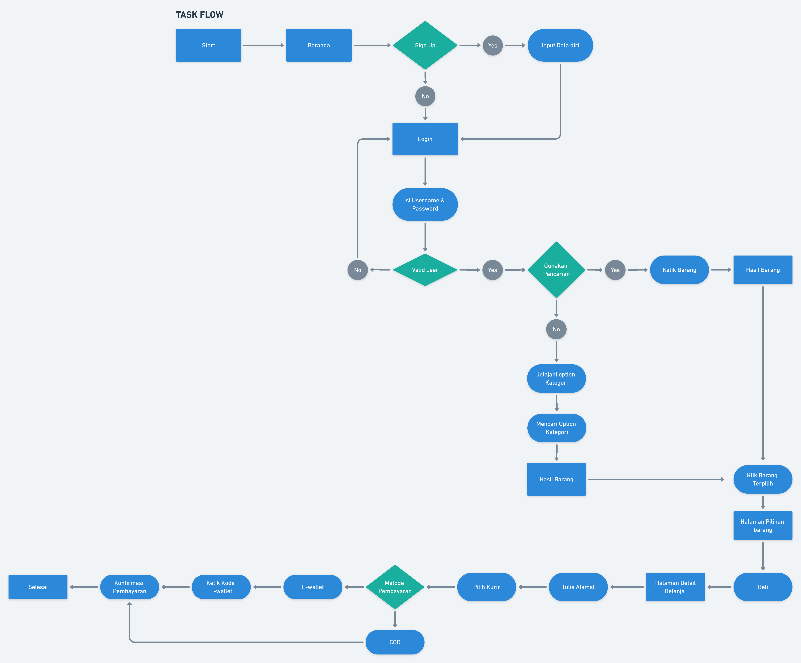

# 5 Interface Structure

## Resume
Dalam materi ini, mempelajari:
1. Pengertian Interface Structure
2. Struktur dalam Interface
3. Komponen pada Interface
4. Apa itu Flow mapping

## Pengertian Interface Structure
Sebuah susunan dari berbagai macam komponen yang menjadi suatu halaman atau suatu fungsi tertentu atau bisa di singkat menjadi UI. Tampilan atau interface sangatlah penting untuk menaikkan minat dalam mengakses aplikasi tersebut. Dengan menggunakan desain UI, maka dapat memodifikasi tampilan dan setiap elemen agar lebih menarik dan meningkatkan minat pengguna untuk mengakses aplikasi. 

## Struktur dalam Interface
 ####  - Input Component
      Komponen dimana user bisa melakukan pengisian data
 ####  - Navigasi Component
      Komponen untuk melakukan aksi berpindah ke halaman satu ke halaman lain juga component satu ke component lain
 ####  - Information component
      Komponen untuk menampilkan informasi kepada user
 ####  - Container Component
      Elemen yang terdiri banyak component lain yang menjadi satu di gabungkan

      
## Komponen pada Interface
- Accordion
- Bento
- Breadcrumb
- Button
- Card
- Carousel
- Check Box
- Comment
- Dropdown
- Icon
- Loader
- Modal
- Notification
- Pagination
- Picker
- Progres bar
- Radio Button
- Side Bar
- Slide Control
- Stepper
- Tag
- Tag Bar
- Tooltip
- Toggle

  
## Apa itu Flow Mapping
Sebuah langkah-langkah yang dilakukan oleh pengguna melalui aplikasi untuk menyelesaikan tugas satu atau beberapa tugas, dan hal ini juga sudah di visualisasikan.
dan beberapa hal penting juga dalam flow mapping ini juga harus di pahami, seperti :
##### - Komunikasi 
Komunikasi sangat penting bagi flow mapping, karna ini adalah salah satu media untuk lintas departement di dalam sebuah perusahaan. dan juga berfungsi untuk mempermudah kolaborasi dengan orang lain.
##### - Dokumentasi
ini adalah fungsi untuk sebagai catatan dokumen pada context transfer
##### - Fokus untuk User
ini akan lebih fokus kepada pengalaman overall saat user menggunakan aplikasi yang kita buat

Selain harus memperhatikan pentingnya dalam sebuah flow mapping, adapun jenis dari flow mapping itu sendiri. berikut ini aadalah jenisnya :
##### - Task Flow
sebuah rangkaian langkah yang di gambarkan untuk satu pekerjaan dan satu tujuan tertentu si pengguna
##### - Wire Flow 
Elemen diagram yang tergambarkan dengan layar real untuk mempermudah perjalanan user di produk 
##### - User Flow 
Hampir sama seperti Wire Flow, akan tetapi User Flow ini menambah beberapa pilihan yang dimiliki pengguna dalam produk

   
   
## Task
## 1. Task Flow Belanja Online 
Pada task ini, Sebuah Task Flow Scenario Belanja Online pada Aplikasi/Website

Berikut hasil dari praktikum ini.

[linkgoogledoc.txt](./praktikum/linkgoogledoc.txt)

output:

