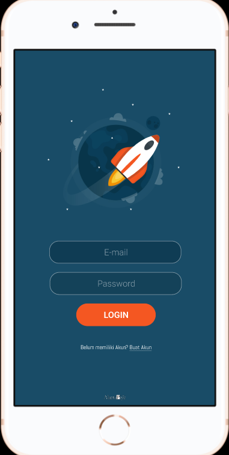

# 6 Figma Introduction Interface Dimension

## Resume
Dalam materi ini, mempelajari:
1. Perkenalan Interface Dimensi
2. Cara memilih Dimensi saat membuat UI
3. Layer Management
4. Styling on Figma

## Perkenalan Interface Dimensi
Adalah sebuah batasan ukuran dari suatu area atau bisa disebut juga sebuah ukuran layar. dari layar tersebut ada beberapa ukuran seperti :
- Dekstop
- Tablet
- Phone

## Cara memilih Dimensi saat membuat UI
untuk memilih dimensi dekstop atau ponsel saat membuat Ui dengan tepat, kita harus merancang sebuah desain aplikasi itu dari paling yang terkecil ( Berdasarkan data pengguna )
dan untuk element designnya bisa mulai dari yang terbesar hingga ke kecil. hal itu sangat di sarankan untuk memulai desain pada aplikasi.

## Layer Management
Dalam mengatur layer agar terlihat mudah dilihat. Layer Management sangatlah penting bagi mendesain sebuah aplikasi, dengan menerapkan Layer Management yang baik
tidak hanya untuk mudah di lihat oleh kita, tetapi saat kita berkolaborasi dengan designer lain dapat mempermudah pemahaman desain kita terhadap tim. Dimulai dari Struktur Layer dan Nested Layer.

## Styling on Figma
- Text Style
- Color Style
- Effect Style
- Image Fill Style
- Grid Style
- Style Tips

## Task
## 1. Membuat Tampilan Login pada Mobile App
Pada task ini, Hanya membuat tampilan interface Login pada Mobile Aplikasi

Berikut hasil dari praktikum ini.

[linkfigma.txt](./praktikum/linkfigma.txt)

output:

