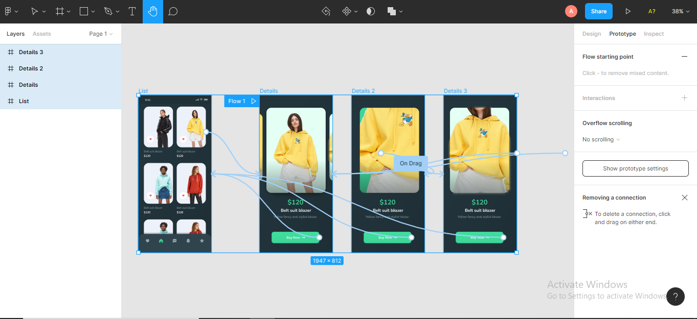

# 8 Figma Prototyping

## Resume
Dalam materi ini, mempelajari:
1. Kenapa Harus Prototyping
2. Tujuan Prototyping
3. Figma Prototyping
4. Action & Trigger Type di Figma

## Kenapa Harus Prototyping
Selain dalam desain website atau aplikasi, haruslah membuat prototypenya juga. dan beberapa yang harus di perhatikan kenapa harus di gunakan prototype ini

### - Testing Instrument
    Dari tahap testing ini kita haru mencoba interface kepada user dengan berguna untuk mengumpulkan insight ataupun feedback yang di 
    berikan user ke kita untuk dapat mengembangkan suatu aplikasi atau website itu sendiri
 
### - Stakeholder Vision
    ini adalah membantu stakeholder untuk dapat melihat vision dari rencanan aplikasai atau website secara interaktif dengan guna 
    untuk para stakeholder dapat lebih memahami fungsi dari aplikasi atau website yang kita buat
    
### - Saving Money
    Dengan menggunakan prototype, kita dapat bisa melakukan testing aplikasi atau website ke user dan hal ini dapat dilakukan 
    sebelum produk di develop dengan guna untuk melihat aplikasi atau website kita sudah benar - benar bisa di gunakan atau tidak 
    dan dapat mengurangi biaya produksi
    
## Tujuan Prototyping
### - Exploration
    Dengan exploration ada eksplor pada fungsi masing" prototype aplikasi atau website yang di buat, ini kita dapat mengetahui apakah
    step/flow yang di buat adalah solusi yang terbaik buat user gunakan. dan hal ini sebagai pengetahuan kekurangan responsive dan 
    kemenarikan sebuah aplikasi atau website itu sendiri.
    
### - Data Collection
    Dengan membuat prototype dari desain yang telah di buat. Maka insight dan feedback dari user dapat kita jadikan sebagai 
    pengembangan aplikasi atau website agar dapat semakin akurat untuk keperluan analisa pengembangan produk.
    
## Prototyping di Figma
ada beberapa tahapan penting pada pembuatan sebuah prototyping di Figma, yaitu :
- Create Connection
- Create Animation
- Prototyping Setting

## Action dan Trigger Type di Figma
### - Action Type
    - Navigate To
    - Open Overlay
    - Scroll to
    - Swap With
    - Back
    - Close Overlay
    - Open link 
    
### - Trigger Type
    - On Click / Tap
    - On Drag
    - While Hovering
    - While Pressing
    - Keyboard Shortcut
    - Mouse Enter
    - Mouse Leave
    - Mouse Down
    - Mouse Up
    - After Delay

## Task
## 1. Membuat Prototype 
Pada task ini, Hanya membuat prototype yang sudah ada dan bebas menggunakan animation/transisi yang tersedia di Figma 

Berikut hasil dari praktikum ini.

[linkfigma.txt](./praktikum/linkfigma.txt)

output:

