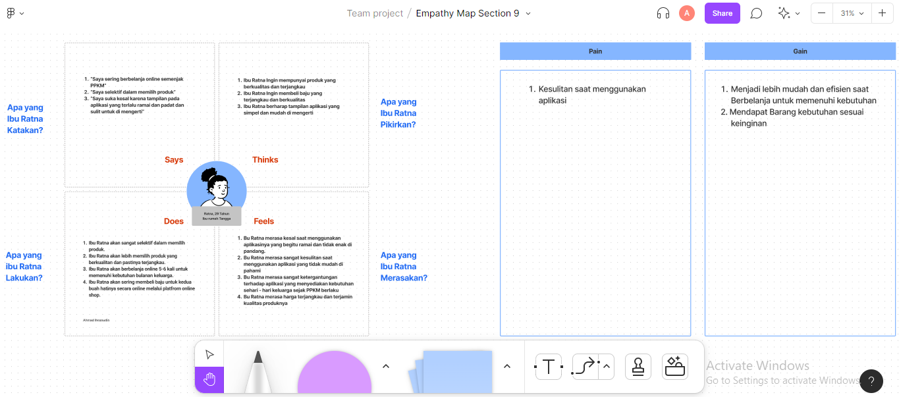

# 9 Figma Colaboration

## Resume
Dalam materi ini, mempelajari:
1. Siapa Saja Yang Akan Berkolaborasi di Figma
2. Versioning on Figma
3. Feature Kolaborasi di Figma

## Siapa Saja Yang Akan Berkolaborasi di Figma
### - Project Manager
    - Melihat Current progress interface untuk dapat melihat perkembangan dari sebuah interface
    - Memastikan kembali flow untuk dapat mempermudah penyesuaian 
    
### - UI/UX Designer
    Mendesain sebuah Interface agar dapat menampilkan sebuah prototype dari aplikasi

### - Engineer
    - Melihat Desain untuk di Develop
    - Mendownload Asset yang di perlukan 
    - Melihat Flow
    - Diskusi API Kontrak

### - Illustrator
    - Melihat desain placement untuk icon
    - Melihat desain placement untuk illustrasi

### - Copy Writer
    Melihat desain placement untuk copy atau tulisan yang di perlukan
    
## Versioning Figma
Dokumentasi Sebagai dokumentasi setiap ada perubahan dari interface
    
## Feature Kolaborasi di Figma
### - Comment
    Dapat bisa meninggalkan sebuah comment text pada sebuah element desain

### - Live Chat
    Dapat bisa melakukan Chat secara live dengan menekan tombol "/" di keyboard

### - Observasi
    Ketika berkolaborasi secara langsung kita bisa melihat dan mengikuti pergerakan mouse orang lain secara realtime dengan 
    melakukan klik pada icon orang tersebut

### - Page Management
    Memisahkan halaman dimana kita sebagai designer melakukan explorasi dan hasil final sebuah desain

### - Naming Style
    Kita harus berdiskusi dengan team enginer untuk menyepakati format bagaimana kita menamai element pada desain

## Task
## 1. Membuat Emphatize Map di Figma Jam
Pada task ini, Membuat sebuah emphatize map di Figma Jam yang di kelompokan 4 orang dari user persona lalu sebagai sebuah template :

Berikut hasil dari praktikum ini.

[linkfigma.txt](./praktikum/linkfigma.txt)

output:

